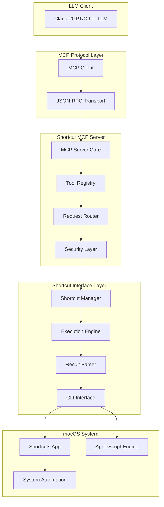
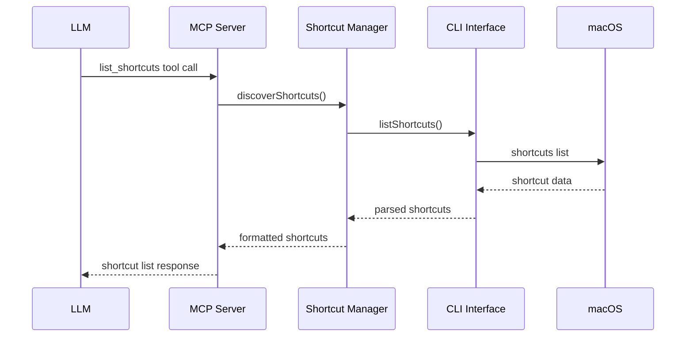
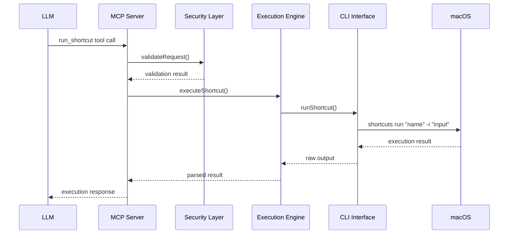

# Architecture Overview

## System Design

The Shortcut MCP is designed as a bridge between Large Language Models and macOS Shortcuts, following the Model Context Protocol specification. The architecture is modular, secure, and extensible.

## High-Level Architecture



## Component Breakdown

### 1. MCP Server Core (`src/server.ts`)

The central component that implements the MCP protocol:

```typescript
interface MCPServer {
  // Protocol implementation
  handleRequest(request: MCPRequest): Promise<MCPResponse>;
  
  // Tool management
  registerTool(tool: Tool): void;
  listTools(): Tool[];
  
  // Resource management
  listResources(): Resource[];
  readResource(uri: string): Promise<ResourceContent>;
}
```

**Responsibilities:**
- Implement MCP protocol specification
- Handle incoming JSON-RPC requests
- Manage tool registration and discovery
- Coordinate with other components
- Handle errors and responses

### 2. Tool Registry (`src/tools/registry.ts`)

Manages available tools and their definitions:

```typescript
interface ToolRegistry {
  registerTool(tool: ToolDefinition): void;
  getTool(name: string): ToolDefinition | null;
  listTools(): ToolDefinition[];
  validateToolCall(call: ToolCall): ValidationResult;
}
```

**Available Tools:**
- `list_shortcuts`: Discover available shortcuts
- `run_shortcut`: Execute shortcuts with parameters
- `get_shortcut_info`: Retrieve shortcut metadata
- `validate_shortcut`: Check shortcut availability and permissions

### 3. Security Layer (`src/security/`)

Implements comprehensive security controls:

```typescript
interface SecurityManager {
  validateRequest(request: MCPRequest): SecurityResult;
  authorizeShortcut(name: string): boolean;
  sanitizeInput(input: any): any;
  filterOutput(output: any): any;
  auditLog(operation: string, details: any): void;
}
```

**Security Features:**
- Input validation and sanitization
- Shortcut allowlist/blocklist management
- Execution timeout enforcement
- Audit logging
- Permission verification

### 4. Shortcut Manager (`src/shortcuts/manager.ts`)

Central component for shortcut operations:

```typescript
interface ShortcutManager {
  discoverShortcuts(): Promise<Shortcut[]>;
  getShortcutInfo(name: string): Promise<ShortcutInfo>;
  validateShortcut(name: string): Promise<ValidationResult>;
  executeShortcut(request: ExecutionRequest): Promise<ExecutionResult>;
}
```

**Features:**
- Shortcut discovery and caching
- Metadata extraction
- Permission checking
- Execution coordination

### 5. Execution Engine (`src/shortcuts/executor.ts`)

Handles the actual execution of shortcuts:

```typescript
interface ExecutionEngine {
  execute(shortcut: Shortcut, input?: any): Promise<ExecutionResult>;
  prepareInput(shortcut: Shortcut, input: any): ProcessedInput;
  handleTimeout(execution: Promise<any>): Promise<any>;
  parseOutput(rawOutput: string): ParsedOutput;
}
```

**Execution Flow:**
1. Input validation and preparation
2. Security checks and permissions
3. Shortcut execution via CLI
4. Output parsing and formatting
5. Error handling and logging

### 6. CLI Interface (`src/cli/interface.ts`)

Interfaces with macOS shortcuts command-line tools:

```typescript
interface CLIInterface {
  runShortcut(name: string, input?: string): Promise<string>;
  listShortcuts(): Promise<string>;
  getShortcutInfo(name: string): Promise<string>;
  checkPermissions(): Promise<boolean>;
}
```

**Implementation:**
- Uses macOS `shortcuts` command-line tool
- Falls back to AppleScript for advanced operations
- Handles process management and timeouts
- Formats output for consumption

## Data Flow

### 1. Shortcut Discovery Flow



### 2. Shortcut Execution Flow



## Error Handling Strategy

### Error Types

1. **Protocol Errors**: MCP specification violations
2. **Validation Errors**: Invalid inputs or parameters
3. **Security Errors**: Permission denied or security violations
4. **Execution Errors**: Shortcut runtime failures
5. **System Errors**: macOS or CLI interface issues

### Error Handling Hierarchy

```typescript
abstract class MCPError extends Error {
  abstract code: string;
  abstract httpStatus: number;
}

class ValidationError extends MCPError {
  code = 'VALIDATION_ERROR';
  httpStatus = 400;
}

class SecurityError extends MCPError {
  code = 'SECURITY_ERROR';
  httpStatus = 403;
}

class ExecutionError extends MCPError {
  code = 'EXECUTION_ERROR';
  httpStatus = 500;
}
```

## Configuration Architecture

### Configuration Layers

1. **Default Configuration**: Built-in sensible defaults
2. **File Configuration**: JSON/YAML configuration files
3. **Environment Variables**: Runtime overrides
4. **Command Line Arguments**: Immediate overrides

### Configuration Schema

```typescript
interface Configuration {
  server: ServerConfig;
  shortcuts: ShortcutConfig;
  security: SecurityConfig;
  logging: LoggingConfig;
  performance: PerformanceConfig;
}
```

## Performance Considerations

### Caching Strategy

1. **Shortcut Metadata Cache**: Cache shortcut information
2. **Execution Result Cache**: Cache deterministic results
3. **Permission Cache**: Cache authorization decisions

### Optimization Techniques

1. **Lazy Loading**: Load shortcuts on demand
2. **Connection Pooling**: Reuse system connections
3. **Batching**: Group multiple operations
4. **Streaming**: Handle large outputs efficiently

## Extensibility Points

### Plugin Architecture

```typescript
interface Plugin {
  name: string;
  version: string;
  initialize(server: MCPServer): Promise<void>;
  registerTools(): ToolDefinition[];
  registerResources(): ResourceDefinition[];
}
```

### Custom Tool Development

Tools can be added by implementing the `Tool` interface:

```typescript
interface Tool {
  name: string;
  description: string;
  inputSchema: JSONSchema;
  execute(input: any): Promise<ToolResult>;
}
```

## Security Architecture

### Defense in Depth

1. **Input Validation**: Strict parameter validation
2. **Authorization**: Permission-based access control
3. **Sandboxing**: Isolated execution environment
4. **Audit Logging**: Comprehensive operation logging
5. **Rate Limiting**: Prevent abuse and DoS

### Trust Model

- **LLM Client**: Trusted but validated
- **MCP Server**: Trusted intermediary
- **Shortcut Content**: Untrusted, requires validation
- **System Integration**: Privileged but controlled

## Deployment Architecture

### Development Environment
- Local development with hot reload
- Mocked shortcut responses for testing
- Debug logging and introspection

### Production Environment
- Standalone binary or npm package
- Comprehensive logging and monitoring
- Resource limits and security controls

### Integration Patterns

1. **Direct Integration**: MCP client directly connects
2. **Proxy Integration**: Through MCP proxy server
3. **Service Integration**: As part of larger automation platform

This architecture provides a solid foundation for secure, reliable, and extensible shortcut automation through the MCP protocol.
