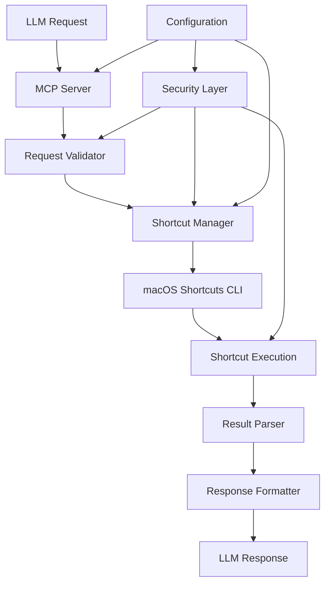

# Development Guide

This document provides comprehensive instructions for developing and contributing to the Shortcut MCP project.

## Development Environment Setup

### Prerequisites

1. **macOS Development Environment**:
   - macOS 12.0 (Monterey) or later
   - Xcode Command Line Tools: `xcode-select --install`
   - Homebrew (recommended): `/bin/bash -c "$(curl -fsSL https://raw.githubusercontent.com/Homebrew/install/HEAD/install.sh)"`

2. **Node.js Environment**:
   - Node.js 18.0+ (use nvm for version management)
   - npm 8.0+ or yarn 1.22+
   - TypeScript 4.9+

3. **Development Tools**:
   - VS Code or your preferred IDE
   - Git for version control
   - Optional: macOS Shortcuts app for testing

### Initial Setup

```bash
# Clone and setup
git clone <repository-url>
cd shortcut-mcp

# Install dependencies
npm install

# Install development dependencies
npm install --save-dev @types/node typescript nodemon jest @types/jest

# Build the project
npm run build

# Run tests
npm test

# Start development server with hot reload
npm run dev
```

## Project Architecture

### Core Components

```
src/
├── index.ts              # Entry point and server initialization
├── server.ts             # Main MCP server implementation
├── shortcuts/
│   ├── manager.ts        # Shortcut discovery and management
│   ├── executor.ts       # Shortcut execution engine
│   ├── parser.ts         # Output parsing and formatting
│   └── validator.ts      # Input validation and security
├── types/
│   ├── shortcuts.ts      # Shortcut-related type definitions
│   ├── mcp.ts           # MCP protocol types
│   └── config.ts        # Configuration types
├── utils/
│   ├── logger.ts        # Logging utilities
│   ├── config.ts        # Configuration management
│   ├── errors.ts        # Custom error classes
│   └── security.ts      # Security utilities
└── cli/
    ├── interface.ts     # CLI interface to macOS shortcuts
    └── applescript.ts   # AppleScript execution utilities
```

### Data Flow



## Implementation Details

### MCP Server Implementation

The core MCP server (`src/server.ts`) implements the following tools:

1. **list_shortcuts**: Discovers available shortcuts
2. **run_shortcut**: Executes shortcuts with parameters
3. **get_shortcut_info**: Retrieves shortcut metadata

### Shortcut Manager (`src/shortcuts/manager.ts`)

```typescript
export class ShortcutManager {
  async listShortcuts(filter?: ShortcutFilter): Promise<Shortcut[]>
  async getShortcutInfo(name: string): Promise<ShortcutInfo>
  async validateShortcut(name: string): Promise<boolean>
}

interface Shortcut {
  name: string;
  description?: string;
  category: string;
  inputTypes: InputType[];
  outputType: OutputType;
  icon?: string;
  lastModified: Date;
}
```

### Execution Engine (`src/shortcuts/executor.ts`)

```typescript
export class ShortcutExecutor {
  async execute(
    shortcutName: string, 
    input?: any, 
    parameters?: Record<string, any>
  ): Promise<ExecutionResult>
  
  private validateInput(shortcut: Shortcut, input: any): boolean
  private formatOutput(rawOutput: any, outputType: OutputType): any
}

interface ExecutionResult {
  success: boolean;
  output?: any;
  error?: string;
  executionTime: number;
  logs?: string[];
}
```

### CLI Interface (`src/cli/interface.ts`)

Interfaces with macOS shortcuts using:
- `shortcuts` command-line tool
- AppleScript for advanced operations
- System Events for automation

```typescript
export class ShortcutCLI {
  async runShortcut(name: string, input?: string): Promise<string>
  async listShortcuts(): Promise<string>
  async getShortcutInfo(name: string): Promise<string>
}
```

## Configuration Management

### Configuration File Structure

```typescript
interface Config {
  server: {
    name: string;
    version: string;
    port?: number;
    host?: string;
  };
  shortcuts: {
    allowedPrefixes: string[];
    blockedShortcuts: string[];
    maxExecutionTime: number;
    defaultTimeout: number;
  };
  security: {
    requireConfirmation: boolean;
    logExecutions: boolean;
    allowSystemShortcuts: boolean;
    sandboxMode: boolean;
  };
  logging: {
    level: 'debug' | 'info' | 'warn' | 'error';
    file?: string;
    console: boolean;
  };
}
```

### Environment Variables

```bash
# Development
NODE_ENV=development
DEBUG=shortcut-mcp:*
LOG_LEVEL=debug

# Production
NODE_ENV=production
LOG_LEVEL=info
MAX_EXECUTION_TIME=30000
```

## Testing Strategy

### Unit Tests

```typescript
// Example test structure
describe('ShortcutManager', () => {
  let manager: ShortcutManager;
  
  beforeEach(() => {
    manager = new ShortcutManager(mockConfig);
  });
  
  test('should list available shortcuts', async () => {
    const shortcuts = await manager.listShortcuts();
    expect(shortcuts).toBeInstanceOf(Array);
    expect(shortcuts.length).toBeGreaterThan(0);
  });
  
  test('should execute shortcut with parameters', async () => {
    const result = await manager.execute('Test Shortcut', 'input', {});
    expect(result.success).toBe(true);
  });
});
```

### Integration Tests

```typescript
describe('MCP Server Integration', () => {
  test('should handle list_shortcuts tool call', async () => {
    const request = {
      method: 'tools/call',
      params: {
        name: 'list_shortcuts',
        arguments: {}
      }
    };
    
    const response = await server.handleRequest(request);
    expect(response.content).toBeDefined();
  });
});
```

### Test Setup

```bash
# Run all tests
npm test

# Run tests with coverage
npm run test:coverage

# Run tests in watch mode
npm run test:watch

# Run integration tests only
npm run test:integration
```

## Security Considerations

### Permission Model

1. **Shortcut Permissions**: Verify shortcuts have proper permissions
2. **Input Sanitization**: Validate all inputs before execution
3. **Output Filtering**: Filter sensitive information from outputs
4. **Execution Limits**: Implement timeouts and resource limits

### Security Implementation

```typescript
export class SecurityValidator {
  validateShortcutName(name: string): boolean {
    // Check against blocked list
    // Validate naming patterns
    // Ensure no path traversal
  }
  
  sanitizeInput(input: any): any {
    // Remove potentially dangerous content
    // Validate data types
    // Check size limits
  }
  
  filterOutput(output: any): any {
    // Remove sensitive data
    // Sanitize file paths
    // Filter system information
  }
}
```

## Build and Deployment

### Build Process

```bash
# Development build
npm run build:dev

# Production build
npm run build:prod

# Clean build
npm run clean && npm run build
```

### Package Structure

```typescript
// package.json scripts
{
  "scripts": {
    "build": "tsc",
    "build:watch": "tsc --watch",
    "start": "node dist/index.js",
    "dev": "nodemon src/index.ts",
    "test": "jest",
    "test:watch": "jest --watch",
    "lint": "eslint src/**/*.ts",
    "lint:fix": "eslint src/**/*.ts --fix"
  }
}
```

### Distribution

The MCP server can be distributed as:
1. **npm package**: For Node.js environments
2. **Standalone binary**: Using pkg or similar tools
3. **macOS app bundle**: For easy installation

## Debugging and Troubleshooting

### Debug Configuration

```typescript
// Debug logging setup
import debug from 'debug';

const log = debug('shortcut-mcp:main');
const shortcutLog = debug('shortcut-mcp:shortcuts');
const securityLog = debug('shortcut-mcp:security');

// Usage
log('Server starting on port %d', port);
shortcutLog('Executing shortcut: %s', shortcutName);
```

### Common Development Issues

1. **Shortcut Discovery Fails**:
   - Check macOS permissions
   - Verify shortcuts CLI availability
   - Test with `shortcuts list` command

2. **Execution Timeouts**:
   - Increase timeout values
   - Check shortcut complexity
   - Monitor system resources

3. **Permission Errors**:
   - Grant automation permissions
   - Check system security settings
   - Verify application signatures

### Development Tools

```bash
# Check shortcuts CLI availability
which shortcuts

# List available shortcuts
shortcuts list

# Test shortcut execution
shortcuts run "Shortcut Name"

# Monitor system logs
log stream --predicate 'process == "shortcuts"'
```

## Contributing Guidelines

### Code Style

- Use TypeScript strict mode
- Follow ESLint configuration
- Use Prettier for formatting
- Write comprehensive JSDoc comments

### Git Workflow

1. Create feature branch from `main`
2. Implement changes with tests
3. Run linting and tests
4. Submit pull request with description
5. Address review feedback

### Pull Request Template

```markdown
## Description
Brief description of changes

## Type of Change
- [ ] Bug fix
- [ ] New feature
- [ ] Breaking change
- [ ] Documentation update

## Testing
- [ ] Unit tests pass
- [ ] Integration tests pass
- [ ] Manual testing completed

## Checklist
- [ ] Code follows style guidelines
- [ ] Self-review completed
- [ ] Documentation updated
- [ ] No breaking changes (or documented)
```

## Performance Optimization

### Caching Strategy

```typescript
export class ShortcutCache {
  private cache = new Map<string, CacheEntry>();
  
  async getShortcuts(): Promise<Shortcut[]> {
    const cached = this.cache.get('shortcuts');
    if (cached && !this.isExpired(cached)) {
      return cached.data;
    }
    
    const shortcuts = await this.fetchShortcuts();
    this.cache.set('shortcuts', {
      data: shortcuts,
      timestamp: Date.now()
    });
    
    return shortcuts;
  }
}
```

### Memory Management

- Implement proper cleanup for long-running processes
- Use streaming for large file operations
- Monitor memory usage in production

### Optimization Checklist

- [ ] Cache shortcut metadata
- [ ] Implement connection pooling
- [ ] Use async/await properly
- [ ] Minimize system calls
- [ ] Profile memory usage
- [ ] Optimize JSON serialization

This development guide provides the foundation for building and maintaining the Shortcut MCP project. Update this document as the project evolves and new patterns emerge.
